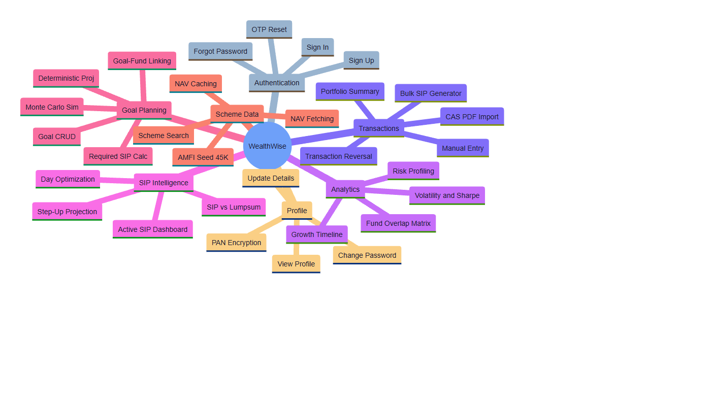

# WealthWise — Software Requirements Specification (SRS)

---

## 1. Introduction

### 1.1 Purpose

This Software Requirements Specification (SRS) document provides a comprehensive, detailed description of the functional and non-functional requirements for the WealthWise portfolio analytics platform. It serves as the binding contract between the development team and stakeholders, defining what the system shall do, under what constraints, and to what quality standards.

This document is intended for:
- **Development team** — as the authoritative reference for implementation
- **Academic evaluators** — as evidence of rigorous requirements engineering
- **Quality assurance** — as the basis for test case derivation
- **Future maintainers** — as the canonical specification for feature evolution

### 1.2 Scope

WealthWise is a web-based mutual fund portfolio management and analytics platform targeting Indian retail investors. The system encompasses:

- **Authentication & Identity Management** — Secure user registration, login, password recovery, and profile management
- **Transaction Management** — Manual entry, bulk SIP generation, CAS PDF import, and transaction reversal
- **Portfolio Intelligence** — Real-time NAV-based valuation, returns computation (XIRR, TWR), risk analytics, and fund overlap detection
- **SIP Intelligence** — Active SIP tracking, streak analysis, SIP vs. lumpsum comparison, day optimization, and step-up projections
- **Goal-Based Planning** — Goal creation with inflation-adjusted targets, Monte Carlo simulation, deterministic projections, and required SIP calculations
- **Scheme Data Management** — AMFI master database seeding, scheme search, and NAV caching

The system does **not** include: brokerage API integrations, payment processing, tax computation, mobile native apps, or multi-currency FX conversion.

### 1.3 Definitions, Acronyms, and Abbreviations

| Term | Definition |
|---|---|
| **AMFI** | Association of Mutual Funds in India — the industry body that assigns unique scheme codes |
| **NAV** | Net Asset Value — the per-unit price of a mutual fund scheme, published daily |
| **CAS** | Consolidated Account Statement — a SEBI-mandated document listing all MF transactions across AMCs |
| **CAMS** | Computer Age Management Services — one of two primary MF registrars in India |
| **KFintech** | Formerly Karvy — the second primary MF registrar in India |
| **SIP** | Systematic Investment Plan — a recurring monthly investment in a mutual fund |
| **SWP** | Systematic Withdrawal Plan — a recurring monthly withdrawal from a mutual fund |
| **STP** | Systematic Transfer Plan — a recurring transfer from one fund to another |
| **XIRR** | Extended Internal Rate of Return — IRR for irregular cash flows |
| **TWR** | Time-Weighted Return — return metric that eliminates the impact of cash flow timing |
| **ELSS** | Equity Linked Savings Scheme — tax-saving MF with 3-year lock-in under Section 80C |
| **SEBI** | Securities and Exchange Board of India — the financial markets regulator |
| **PAN** | Permanent Account Number — 10-character alphanumeric tax identifier issued by the IT Department |
| **AES-256-GCM** | Advanced Encryption Standard with 256-bit key and Galois/Counter Mode (authenticated encryption) |
| **JWT** | JSON Web Token — a compact, URL-safe means of representing claims between two parties |
| **BCrypt** | An adaptive password hashing function based on the Blowfish cipher |
| **FIFO** | First In, First Out — the method used for matching redemption units against purchase lots |
| **OTP** | One-Time Password — a time-limited code used for identity verification |

---

## 2. Overall Description

### 2.1 Product Perspective

WealthWise operates as a **standalone web application** that does not depend on or integrate with any proprietary brokerage platform. It is designed as a post-trade analytics tool — users import existing transaction data (via CAS PDF or manual entry), and the system enriches this data with real-time NAV feeds, scheme metadata, and computed analytics.

The system follows a **three-tier architecture**:

1. **Presentation Tier** — React 19 SPA served as static files from a CDN (Render static site)
2. **Application Tier** — Spring Boot 3.2 REST API deployed as a Docker container on Render
3. **Data Tier** — PostgreSQL 15 hosted on Supabase with connection pooling

External dependencies are limited to two read-only public APIs:
- **mfapi.in** — NAV data retrieval (no API key required)
- **AMFI NAVAll.txt** — Scheme master data seeding (public HTTP endpoint)

### 2.2 Product Functions (Summary)

### 2.3 User Classes and Characteristics

| User Class | Description | Technical Proficiency | Usage Pattern |
|---|---|---|---|
| **Retail Investor** | Individual investing in mutual funds through SIPs or lump sums. Holds 2–15 funds across 1–5 AMCs. | Low to Medium | Weekly dashboard checks; monthly transaction entry; quarterly analytics review |
| **Active Trader** | High-frequency investor who regularly rebalances portfolio, switches between funds, and monitors performance daily. | Medium to High | Daily dashboard access; frequent transaction entry; heavy analytics usage |
| **Financial Planner** | Uses the platform to analyze client portfolios (via CAS imports) and demonstrate goal feasibility. | High | CAS imports for clients; goal analysis sessions; risk profiling |
| **System Administrator** | Manages scheme master data, triggers NAV seeding, and monitors system health. | High | Periodic scheme seeding; reconciliation of synthetic codes; health monitoring |

---

## 3. Functional Requirements

### 3.1 Module M01 — Authentication & User Management

#### FR-01: User Registration
- **ID:** FR-01
- **Priority:** High
- **Description:** The system shall allow new users to register by providing full name, email, password, phone number (optional), currency preference (optional), and PAN card number (optional).
- **Input:** `{ fullName, email, password, phone?, currency?, panCard? }`
- **Processing:**
  1. Validate that the email is not already registered (unique constraint on `users.email`)
  2. Hash the password using BCrypt with default cost factor (10 rounds)
  3. If PAN card is provided, encrypt using AES-256-GCM before database storage
  4. Generate a JWT token with the user's email as the subject and a configurable expiry
  5. Return the JWT token and sanitized user object (password field set to null)
- **Output:** `{ token: string, user: { id, fullName, email, ... } }`
- **Error Cases:**
  - Email already registered → 400 with `{ error: "Email is already registered!" }`
  - Invalid input → 400 with descriptive error message

#### FR-02: User Authentication (Sign In)
- **ID:** FR-02
- **Priority:** High
- **Description:** The system shall authenticate users via email and password, returning a JWT on success.
- **Input:** `{ email, password }`
- **Processing:**
  1. Look up user by email
  2. Compare provided password against BCrypt hash using `PasswordEncoder.matches()`
  3. On success, generate JWT token
  4. Return token and sanitized user object
- **Output:** `{ token: string, user: { id, fullName, email, ... } }`
- **Error Cases:**
  - Invalid credentials → 401 with `{ error: "Invalid email or password" }`

#### FR-03: Password Recovery (Forgot Password)
- **ID:** FR-03
- **Priority:** High
- **Description:** The system shall support password recovery via email-based OTP verification.
- **Sub-Flow 1: Generate OTP**
  - Input: `{ email }`
  - Processing: Generate 6-digit OTP using `SecureRandom`; hash OTP with BCrypt; store hash + 5-minute expiry in user record; send plaintext OTP to email via SMTP
  - Output: `{ message: "OTP generated and sent to email successfully." }`
- **Sub-Flow 2: Verify OTP and Reset Password**
  - Input: `{ email, otp, newPassword }`
  - Processing: Match OTP against stored hash; verify expiry; hash new password; clear OTP fields
  - Output: `{ message: "Password has been successfully reset." }`
- **Error Cases:**
  - Email not found → 400
  - Invalid or expired OTP → 400
  - OTP expiry check: `otpExpiry.isBefore(LocalDateTime.now())`

#### FR-04: User Profile Management
- **ID:** FR-04
- **Priority:** Medium
- **Description:** Authenticated users shall be able to view and update their profile, and change their password.
- **FR-04.1: Get Profile** — Returns user object with PAN masked (format: `ABCDE****F`)
- **FR-04.2: Update Profile** — Updates fullName, phone, currency, panCard fields
- **FR-04.3: Change Password** — Requires current password verification; new password must be ≥8 characters

#### FR-05: Health Check Endpoint
- **ID:** FR-05
- **Priority:** High
- **Description:** The system shall expose a public health check endpoint at `GET /api/auth/health` that returns `{ status: "UP" }` for use by Render's health check polling and the frontend warmup mechanism.

---

### 3.2 Module M02 — Scheme Master Management

#### FR-06: Scheme Database Seeding
- **ID:** FR-06
- **Priority:** High
- **Description:** The system shall seed the scheme master database by parsing AMFI's NAVAll.txt file, extracting scheme metadata (AMFI code, ISIN, scheme name, AMC, plan type, option type, fund type, SEBI category, broad category, risk level, and latest NAV).
- **Processing:**
  1. Fetch NAVAll.txt from `https://www.amfiindia.com/spages/NAVAll.txt`
  2. Parse pipe-delimited fields: `Scheme Code;ISIN Div Payout/ISIN Growth;ISIN Div Reinvestment;Scheme Name;Net Asset Value;Date`
  3. Infer `planType` (DIRECT/REGULAR), `optionType` (GROWTH/IDCW), `fundType` (OPEN_ENDED/CLOSE_ENDED) from scheme name
  4. Map SEBI category from section headers in the file
  5. Derive `broadCategory` (EQUITY/DEBT/HYBRID/SOLUTION/OTHER) and `riskLevel` (1–6) from SEBI category
  6. Upsert into `scheme_master` table (insert or update on `amfi_code` conflict)
- **Output:** `{ totalProcessed, newInserted, updated }`

#### FR-07: Scheme Search
- **ID:** FR-07
- **Priority:** High
- **Description:** The system shall provide a paginated, filterable search over the scheme master database.
- **Parameters:** `q` (search term), `category` (e.g., EQUITY), `planType` (e.g., DIRECT), `page`, `size`
- **Output:** Paginated result with `{ content, totalElements, totalPages, page }`

#### FR-08: Scheme Lookup by AMFI Code
- **ID:** FR-08
- **Priority:** Medium
- **Description:** The system shall return scheme metadata for a given AMFI code. Returns 404 if not found.

---

### 3.3 Module M03 — NAV Management

#### FR-09: Latest NAV Retrieval
- **ID:** FR-09
- **Priority:** High
- **Description:** The system shall fetch the latest NAV for a given AMFI code from mfapi.in, with a 24-hour Caffeine cache.
- **Cache Strategy:** First check `nav_latest` cache → if miss, fetch from `https://api.mfapi.in/mf/{amfiCode}/latest` → cache result for 24h

#### FR-10: Historical NAV Retrieval
- **ID:** FR-10
- **Priority:** High
- **Description:** The system shall fetch and persist the full historical NAV data for a scheme, with a 7-day Caffeine cache.
- **Processing:** Fetch from mfapi.in → persist each NAV entry to `nav_history` table using atomic `INSERT ON CONFLICT DO NOTHING` → cache in memory for 7 days

#### FR-11: NAV for Specific Date
- **ID:** FR-11
- **Priority:** Medium
- **Description:** The system shall return the NAV for a scheme on a specific date. If no NAV exists for that date (market holiday), the system shall return null with an advisory message to use the nearest available NAV.

#### FR-12: NAV Cache Refresh
- **ID:** FR-12
- **Priority:** Medium
- **Description:** The system shall support forced NAV refresh via `POST /api/nav/refresh/{amfiCode}`, bypassing the cache and fetching fresh data from mfapi.in.

---

### 3.4 Module M04 — Transaction Management

#### FR-13: Record Transaction
- **ID:** FR-13
- **Priority:** High
- **Description:** The system shall record a mutual fund transaction with automatic investment lot creation and management.
- **Supported Types:** PURCHASE_LUMPSUM, PURCHASE_SIP, REDEMPTION, SWITCH_IN, SWITCH_OUT, SWP, STP_IN, STP_OUT, DIVIDEND_PAYOUT, DIVIDEND_REINVEST
- **Processing for Purchase Types:**
  1. Generate unique transaction reference (`TXN-{userId}-{timestamp}-{random}`)
  2. If NAV not provided, fetch latest NAV from mfapi.in
  3. Compute units = amount / NAV (scale: 6 decimals)
  4. Apply 0.005% stamp duty for purchases
  5. Create `InvestmentLot` record with `unitsOriginal = unitsRemaining = computed units`
  6. If ELSS scheme, set `isElss = true` and `elssLockUntil = purchaseDate + 3 years`
- **Processing for Redemption Types:**
  1. Fetch active investment lots for the scheme (ordered by purchase date ASC — FIFO)
  2. Subtract redeemed units from lots, zeroing out fully redeemed lots
  3. Validate sufficient units available; throw `IllegalStateException` if shortfall
- **Edge Cases:**
  - Partial lot redemption (lot has more units than redeemed)
  - Multi-lot redemption spanning 3+ lots
  - ELSS lock-in violation (redemption before 3-year lock)

#### FR-14: Bulk SIP Generator
- **ID:** FR-14
- **Priority:** Medium
- **Description:** The system shall generate multiple SIP transactions at once for a specified date range (up to 120 months / 10 years).
- **Input:** `{ schemeAmfiCode, schemeName, folioNumber, amount, startDate, endDate }`
- **Processing:** For each month in the range, create a PURCHASE_SIP transaction on the SIP date (1st of each month), fetching historical NAV for each date.

#### FR-15: CAS PDF Import
- **ID:** FR-15
- **Priority:** High
- **Description:** The system shall parse an uploaded CAS PDF file and import all transactions.
- **Processing:**
  1. Validate file is PDF (content-type check)
  2. Extract text from all pages using Apache PDFBox
  3. Parse folio numbers, scheme names, and transaction rows using regex patterns
  4. Map scheme names to AMFI codes using the scheme master database
  5. For unresolvable schemes, generate synthetic `WW_ISIN_*` codes and flag for later reconciliation
  6. Create transactions and investment lots for all parsed entries
  7. Log the upload in `cas_upload_log` with status (SUCCESS/FAILED), total folios, and total transactions
- **Output:** `{ totalFolios, totalTransactions, syntheticCodes[], status }`

#### FR-16: Synthetic Scheme Reconciliation
- **ID:** FR-16
- **Priority:** Medium
- **Description:** The system shall reconcile synthetic `WW_ISIN_*` codes generated during CAS import with real AMFI codes by searching mfapi.in. The operation is idempotent and atomically updates transactions, investment lots, and scheme master records.

#### FR-17: Transaction Reversal
- **ID:** FR-17
- **Priority:** Medium
- **Description:** The system shall support reversing a transaction by creating a mirror transaction of opposite type. Reversal of a PURCHASE creates a REDEMPTION (returning units to the lot), and vice versa.

#### FR-18: Portfolio Summary
- **ID:** FR-18
- **Priority:** High
- **Description:** The system shall compute and return a per-scheme portfolio summary including: scheme name, total units held, total invested amount, current NAV, current value, unrealized P&L, and percentage return.

---

### 3.5 Module M05 — Returns & Analytics

#### FR-19: Portfolio Returns
- **ID:** FR-19
- **Priority:** High
- **Description:** The system shall compute portfolio-level returns including total invested, current value, XIRR, absolute return, and a growth timeline (monthly portfolio value snapshots for charting).

#### FR-20: Per-Scheme Returns
- **ID:** FR-20
- **Priority:** Medium
- **Description:** The system shall compute returns for a specific scheme including invested amount, current value, XIRR, TWR, and a scheme-level growth timeline.

#### FR-21: Risk Profiling
- **ID:** FR-21
- **Priority:** High
- **Description:** The system shall compute portfolio risk metrics:
  - **Annualized Volatility** — Standard deviation of daily NAV returns, annualized (×√252)
  - **Sharpe Ratio** — (Portfolio Return − Risk-Free Rate) / Volatility
  - **Weighted Risk Score** — Portfolio-level SEBI riskometer score (1–6) weighted by allocation
  - **Risk Category** — CONSERVATIVE / MODERATE / AGGRESSIVE based on weighted score thresholds

#### FR-22: Fund Overlap Analysis
- **ID:** FR-22
- **Priority:** Medium
- **Description:** The system shall compute pairwise stock-level overlap between all funds in a user's portfolio.
- **Processing:**
  1. For each scheme, retrieve stock holdings from `fund_holdings` table (populated by `FundHoldingsIngestionService` based on SEBI category rules)
  2. Compute Jaccard overlap: `|A ∩ B| / |A ∪ B|` for every pair of schemes
  3. Return overlap matrix, high-overlap pairs (>30%), and consolidation suggestions

#### FR-23: User Risk Profile Save
- **ID:** FR-23
- **Priority:** Low
- **Description:** The system shall allow users to manually set their risk profile (CONSERVATIVE / MODERATE / AGGRESSIVE) which is persisted in the `users.risk_profile` column.

---

### 3.6 Module M06 — SIP Intelligence

#### FR-24: SIP Dashboard
- **ID:** FR-24
- **Priority:** Medium
- **Description:** The system shall analyze transaction history to detect active SIPs and compute: total active SIPs, monthly outflow, next step-up date, projected corpus, SIP streak (consecutive months maintained), and health alerts.
- **SIP Detection Logic:** A SIP is considered active if there are ≥3 PURCHASE_SIP transactions for the same scheme with consistent monthly intervals in the last 6 months.

#### FR-25: SIP vs. Lumpsum Comparison
- **ID:** FR-25
- **Priority:** Medium
- **Description:** The system shall compare SIP returns against a hypothetical lumpsum investment of the same total amount invested on the SIP start date.

#### FR-26: SIP Day Optimization
- **ID:** FR-26
- **Priority:** Low
- **Description:** The system shall recommend the optimal day of the month for SIP execution based on historical NAV volatility patterns.

#### FR-27: SIP Step-Up Projection
- **ID:** FR-27
- **Priority:** Medium
- **Description:** The system shall project SIP outcomes with and without annual step-up (default: 10% per year) over the remaining investment horizon.

---

### 3.7 Module M07 — Goal Planning

#### FR-28: Goal CRUD Operations
- **ID:** FR-28
- **Priority:** Medium
- **Description:** Users shall be able to create, read, update, and delete financial goals with attributes: goal name, type (RETIREMENT, HOUSE, EDUCATION, WEDDING, EMERGENCY, VACATION, CAR, CUSTOM), icon, target amount (today's money), inflation rate, target date, priority (LOW/MEDIUM/HIGH), monthly SIP allocation, and expected return rate.

#### FR-29: Goal Analysis Engine
- **ID:** FR-29
- **Priority:** High
- **Description:** The system shall provide a unified analysis endpoint that runs three engines simultaneously:
- **FR-29.1: Monte Carlo Simulation** — 10,000 iterations with Gaussian random returns; floor limiting by volatility tier; output: P10/P50/P90 in today's money; probability of success against inflation-adjusted target
- **FR-29.2: Deterministic Projection** — Simple compound growth projection with sensitivity analysis: (a) Return = 10% pa scenario, (b) 6 SIPs missed scenario, (c) Inflation +2% scenario; output: projected corpus, gap, on-track boolean
- **FR-29.3: Required SIP Calculator** — Computes the required monthly SIP to meet the goal, current SIP gap, equivalent lump-sum today, and additional months needed at current SIP rate

#### FR-30: Goal-Fund Linking
- **ID:** FR-30
- **Priority:** Low
- **Description:** Users shall be able to link investment lots to goals with allocation percentages (1–100%), enabling tracking of how much of each goal's target is funded by existing investments.

---

## 4. Non-Functional Requirements

### 4.1 Performance

| ID | Requirement | Target |
|---|---|---|
| NFR-01 | Dashboard page load time (after backend warm) | ≤ 3 seconds |
| NFR-02 | Analytics computation (risk + overlap + SIP) | ≤ 5 seconds for portfolios with ≤50 schemes |
| NFR-03 | CAS PDF parsing (10-page document) | ≤ 10 seconds |
| NFR-04 | Monte Carlo simulation (10,000 iterations) | ≤ 2 seconds |
| NFR-05 | Scheme search query response time | ≤ 500 ms |
| NFR-06 | Backend cold-start time (Docker on Render free tier) | ≤ 90 seconds |

### 4.2 Scalability

| ID | Requirement |
|---|---|
| NFR-07 | Support up to 10,000 registered users with independent portfolios |
| NFR-08 | Scheme master database supports 50,000+ schemes without performance degradation |
| NFR-09 | NAV history table supports 10M+ rows with indexed queries <200ms |
| NFR-10 | Caffeine cache sized for 50K latest NAV entries and 500K historical entries |

### 4.3 Security

| ID | Requirement |
|---|---|
| NFR-11 | Passwords hashed with BCrypt (cost factor 10, adaptive) |
| NFR-12 | PAN card numbers encrypted at rest with AES-256-GCM |
| NFR-13 | JWT tokens signed with HMAC-SHA256 using a ≥32-character secret |
| NFR-14 | OTPs generated with `SecureRandom` (cryptographic PRNG), stored hashed, with 5-minute expiry |
| NFR-15 | CORS restricted to configured origins only |
| NFR-16 | Security headers on every response: X-Content-Type-Options, X-Frame-Options, X-XSS-Protection, HSTS, Referrer-Policy |
| NFR-17 | API error messages sanitized — no Java class paths or stack traces exposed to clients |
| NFR-18 | Sensitive configuration (DB password, JWT secret, SMTP password) externalized via environment variables; never committed to version control |

### 4.4 Reliability

| ID | Requirement |
|---|---|
| NFR-19 | NAV data persisted to database as write-through cache; survives server restarts |
| NFR-20 | Unique constraint on `(amfi_code, nav_date)` in `nav_history` prevents duplicate entries |
| NFR-21 | CAS upload logged with status audit trail; errors captured in `cas_upload_log.error_message` |
| NFR-22 | Global exception handler prevents unhandled exceptions from leaking internal state |
| NFR-23 | Transaction reversal maintains referential integrity via `reversal_of` foreign key |
| NFR-24 | Backend warmup mechanism allows UI to function within 90 seconds of cold start |

### 4.5 Usability

| ID | Requirement |
|---|---|
| NFR-25 | Dark mode default with premium glassmorphism aesthetic |
| NFR-26 | Responsive layout supporting desktop (1920px), laptop (1366px), and tablet (768px) viewports |
| NFR-27 | Form validation with real-time error messages |
| NFR-28 | Loading states with animated spinners for all asynchronous operations |
| NFR-29 | Error boundary component prevents full-page crashes; displays user-friendly fallback |
| NFR-30 | Backend warmup overlay with elapsed time display and animated loading state |

---

## 5. System Features (Summary Matrix)

| Feature ID | Feature Name | Module | Priority | Complexity |
|---|---|---|---|---|
| F01 | User Sign Up | M01 | High | Low |
| F02 | User Sign In | M01 | High | Low |
| F03 | Forgot Password (OTP) | M01 | High | Medium |
| F04 | Profile Management | M01 | Medium | Low |
| F05 | PAN Card Encryption | M01 | High | Medium |
| F06 | AMFI Scheme Seeding | M02 | High | High |
| F07 | Scheme Search | M02 | High | Low |
| F08 | Latest NAV Fetch | M03 | High | Medium |
| F09 | Historical NAV Fetch | M03 | High | Medium |
| F10 | Manual Transaction Entry | M04 | High | High |
| F11 | Bulk SIP Generator | M04 | Medium | Medium |
| F12 | CAS PDF Import | M04 | High | Very High |
| F13 | Transaction Reversal | M04 | Medium | Medium |
| F14 | Portfolio Summary | M04 | High | Medium |
| F15 | XIRR & TWR Computation | M05 | High | High |
| F16 | Risk Profiling | M05 | High | High |
| F17 | Fund Overlap Analysis | M05 | Medium | Very High |
| F18 | SIP Dashboard | M06 | Medium | High |
| F19 | SIP vs. Lumpsum | M06 | Medium | Medium |
| F20 | SIP Day Optimization | M06 | Low | Medium |
| F21 | SIP Step-Up Projection | M06 | Medium | Medium |
| F22 | Goal CRUD | M07 | Medium | Low |
| F23 | Monte Carlo Simulation | M07 | High | High |
| F24 | Deterministic Projection | M07 | High | Medium |
| F25 | Required SIP Calculator | M07 | Medium | Medium |
| F26 | Goal-Fund Linking | M07 | Low | Medium |

---

## 6. Use Case Specifications

### UC-01: User Registers and Creates First Transaction

| Field | Detail |
|---|---|
| **Use Case ID** | UC-01 |
| **Title** | New User Onboarding and First Transaction |
| **Primary Actor** | Retail Investor |
| **Preconditions** | User has access to a web browser and a valid email address |
| **Trigger** | User clicks "Get Started" on the landing page |

**Main Flow:**
1. User clicks "Get Started" → Auth modal opens on "Sign Up" tab
2. User enters full name, email, password → clicks "Create Account"
3. System validates email uniqueness, hashes password, creates user → returns JWT
4. User is redirected to Dashboard (protected route)
5. Dashboard shows empty state with "Record your first transaction" prompt
6. User navigates to Transactions page → clicks "Add Transaction"
7. User selects scheme (live search with debounce), enters amount, selects date
8. System auto-fetches NAV for the selected date from mfapi.in
9. System computes units (amount / NAV), applies stamp duty, creates transaction + investment lot
10. Dashboard now shows the investment with current value based on latest NAV

**Alternate Flows:**
- **2a.** Email already registered → Error message displayed; suggest "Sign In" instead
- **8a.** NAV not available for the selected date (holiday) → User prompted to select nearest business day
- **9a.** Scheme is ELSS → System sets `is_elss = true` and `elss_lock_until = date + 3 years`

**Edge Cases:**
- User enters PAN card during registration → PAN is AES-256-GCM encrypted before database storage
- User's JWT expires during the transaction entry → ProtectedRoute detects expiry, redirects to landing page

---

### UC-02: Import CAS Statement and View Portfolio

| Field | Detail |
|---|---|
| **Use Case ID** | UC-02 |
| **Title** | CAS PDF Import and Portfolio Consolidation |
| **Primary Actor** | Retail Investor |
| **Preconditions** | User is authenticated; has a CAS PDF from CAMS/KFintech |
| **Trigger** | User clicks "Import CAS" on the Transactions page |

**Main Flow:**
1. User clicks "Import CAS" → file picker opens
2. User selects CAS PDF → system validates file type (application/pdf)
3. System extracts text via PDFBox → parses folio numbers, scheme names, transaction rows
4. For each scheme, system searches `scheme_master` by name → maps to AMFI code
5. For unresolvable schemes, system generates synthetic `WW_ISIN_*` code
6. System creates transactions and investment lots for all parsed entries
7. System logs upload in `cas_upload_log` → returns summary
8. User sees imported transactions on the Transactions page
9. Dashboard updates with consolidated portfolio view

**Alternate Flows:**
- **2a.** File is not PDF → Error: "Valid PDF file is required"
- **4a.** Scheme name partially matches multiple entries → Best match selected by Levenshtein distance
- **5a.** Synthetic codes generated → Banner displayed suggesting "Run Reconciliation"

---

### UC-03: Analyze Portfolio Risk and View Fund Overlap

| Field | Detail |
|---|---|
| **Use Case ID** | UC-03 |
| **Title** | Portfolio Analytics with Risk and Overlap |
| **Primary Actor** | Active Trader |
| **Preconditions** | User has ≥2 schemes with transactions in their portfolio |
| **Trigger** | User navigates to the Analytics page |

**Main Flow:**
1. Analytics page loads → fires three parallel API calls: `/api/analytics/risk`, `/api/analytics/overlap`, `/api/sip/dashboard`
2. Risk profile section displays: portfolio volatility, Sharpe ratio, SEBI risk score, risk category badge
3. Fund overlap section displays: pairwise overlap matrix (heatmap), high-overlap pairs (>30%), and consolidation suggestions
4. SIP intelligence section displays: active SIPs count, monthly outflow, streak, projected corpus
5. User can click on individual fund pairs to see overlapping stock names

**Edge Cases:**
- Portfolio has only 1 scheme → Overlap matrix shows "Add more funds to see overlap"
- NAV history insufficient (<30 days) → Volatility shows "Insufficient data" warning
- All schemes are synthetic `WW_ISIN_*` → Analytics skips NAV-dependent calculations

---

### UC-04: Create a Goal and Run Monte Carlo Analysis

| Field | Detail |
|---|---|
| **Use Case ID** | UC-04 |
| **Title** | Goal Creation with Probabilistic Feasibility Analysis |
| **Primary Actor** | Financial Planner |
| **Preconditions** | User is authenticated |
| **Trigger** | User navigates to Goals page and clicks "Create New Goal" |

**Main Flow:**
1. User fills goal wizard: name ("Retirement Fund"), type (RETIREMENT), target amount (₹5,00,00,000), inflation rate (6%), target date (2050-01-01), monthly SIP (₹25,000), expected return rate (12% pa)
2. System computes `target_amount_future` (inflation-adjusted) and `years_remaining`
3. User clicks "Analyze" → frontend sends POST to `/api/learn/analyse`
4. Backend runs three engines simultaneously:
   - Monte Carlo: 10,000 simulations → P10 = ₹2.1Cr, P50 = ₹4.8Cr, P90 = ₹9.2Cr, Probability = 42.5%
   - Deterministic: Projected = ₹4.6Cr, Gap = ₹40L, NOT on track
   - Required SIP: Need ₹32,000/month (gap: ₹7,000), or ₹18L lump sum today
5. User sees results in an interactive modal with scenario sensitivity analysis

**Edge Cases:**
- Target already achieved (gap ≤ 0) → "On Track" badge displayed; required SIP = 0
- Monthly contribution = 0 → Monte Carlo runs with corpus-only growth
- Extreme volatility (stdDev > 0.07) → Floor limit set to -30% per month to prevent mathematical explosion
