# WealthWise — System Design Document (HLD + LLD)

---

# PART I: HIGH-LEVEL DESIGN (HLD)

---

## 1. Architecture Overview

WealthWise follows a **three-tier client-server architecture** with strict separation of concerns. The design prioritizes:

1. **Statelessness** — No server-side sessions; all authentication state carried in JWT tokens
2. **API-First Design** — Backend exposes a pure REST API; frontend is a completely decoupled SPA
3. **Cache-Layered Data Access** — Caffeine in-memory caching reduces external API calls by 95%+
4. **Security-by-Default** — Every response includes hardened security headers; sensitive data encrypted at rest

### 1.1 Architecture Diagram

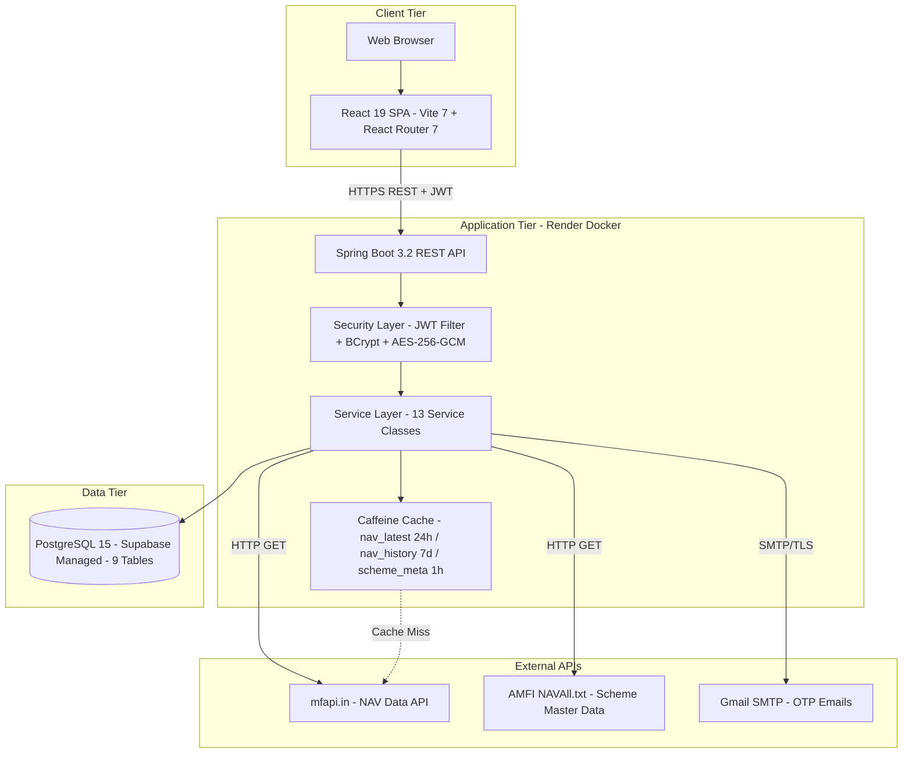

### 1.2 Component Interaction Flow

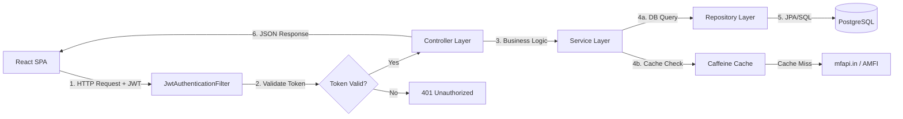

### 1.3 Request Processing Pipeline

Every API request passes through the following pipeline:

| Stage | Component | Responsibility |
|---|---|---|
| 1 | `WebConfig` CORS Interceptor | Validate origin against allow-list; set security headers (HSTS, X-Frame-Options, etc.) |
| 2 | `JwtAuthenticationFilter` | Extract `Authorization: Bearer <token>` header; validate JWT signature + expiry; resolve email → userId; set `request.setAttribute("userId", ...)` |
| 3 | Controller | Parse request body/params; delegate to service; wrap result in `ResponseEntity` |
| 4 | Service | Execute business logic; interact with repositories and external APIs; compute analytics |
| 5 | Repository | JPA-managed database interactions; Spring Data auto-generated queries + native SQL |
| 6 | `GlobalExceptionHandler` | Catch unhandled exceptions; return sanitized error JSON (no stack traces) |

---

## 2. Technology Justification

### 2.1 Why Spring Boot over Node.js/Express?

| Criterion | Spring Boot | Node.js/Express |
|---|---|---|
| **Type Safety** | Java 17 with compile-time type checking prevents runtime type errors in financial calculations | JavaScript's dynamic typing increases risk of subtle numerical bugs |
| **Financial Precision** | Native `BigDecimal` support with configurable precision (18,4 for amounts, 18,6 for units) | JavaScript `Number` uses IEEE 754 doubles — inherent floating-point precision loss |
| **Thread Model** | Multi-threaded; Monte Carlo 10K iterations utilize thread pool efficiently | Single-threaded event loop; CPU-bound Monte Carlo blocks the entire server |
| **Security Framework** | Spring Security provides enterprise-grade filter chain, BCrypt, CORS, CSRF | Manual middleware assembly with limited security abstractions |
| **ORM Maturity** | JPA/Hibernate — 20+ years of production hardening; relationship mapping, lazy loading, L2 cache | Sequelize/TypeORM — less mature; weaker migration tooling |
| **PDF Parsing** | Apache PDFBox — pure Java, no native dependencies, battle-tested | pdf.js works but slower; native alternatives (pdftotext) add system dependencies |

### 2.2 Why PostgreSQL over MySQL/MongoDB?

| Criterion | PostgreSQL |
|---|---|
| **ACID Compliance** | Full transactional support for financial data; critical for concurrent lot modifications |
| **INSERT ON CONFLICT** | Native upsert syntax used for idempotent NAV history ingestion (prevents duplicate violations) |
| **Window Functions** | Used in analytics queries for running totals, rank-based lot selection |
| **JSON Support** | `jsonb` type available for future extensibility (e.g., storing raw CAS parse results) |
| **Supabase Ecosystem** | Managed hosting with auto-backups, connection pooling, Row Level Security, and a web dashboard |

### 2.3 Why React 19 over Angular/Vue?

| Criterion | React 19 |
|---|---|
| **Concurrent Rendering** | React 19's `useTransition` enables smooth analytics chart rendering without blocking user input |
| **Ecosystem** | Recharts, Framer Motion, React Router — all first-class React integrations |
| **Component Model** | Functional components with hooks enable clean separation of data fetching (AuthContext), state management (useState/useEffect), and presentation |
| **Community & Hiring** | Largest frontend ecosystem; most tutorials, libraries, and developer availability |

---

## 3. Caching Architecture

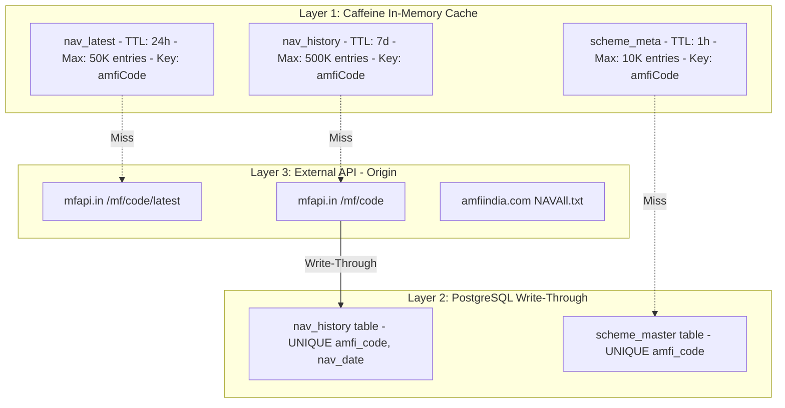

**Design Rationale:**
- NAV data is near-immutable once published (historical NAVs never change) → 7-day cache is safe
- Latest NAV updates once daily (after 11 PM IST when AMFI publishes) → 24-hour cache is optimal
- Caffeine eliminates 95%+ of external API calls, keeping mfapi.in within rate limits
- Write-through to PostgreSQL ensures data survives process restarts

---

## 4. Security Architecture

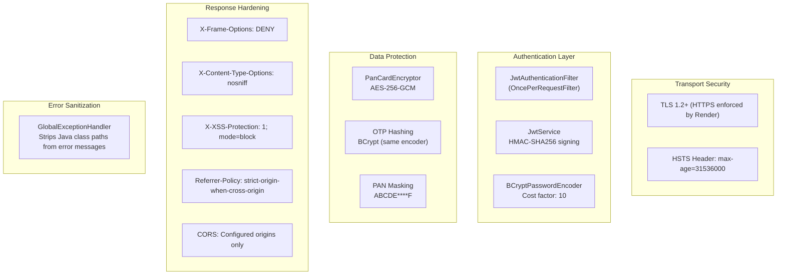

**Key Security Decisions:**

| Decision | Rationale |
|---|---|
| BCrypt over SHA-256 for passwords | BCrypt is adaptive (cost factor can increase over time); resistant to rainbow tables and GPU attacks |
| AES-256-GCM over AES-CBC for PAN | GCM provides authenticated encryption — detects tampering; no padding oracle vulnerabilities |
| Key derivation from JWT secret | Avoids introducing a second secret; SHA-256 hash of JWT secret produces a strong 256-bit AES key |
| Random IV per encryption | Prevents identical PAN values from producing identical ciphertexts |
| OTP hashed (not plaintext) | If DB is compromised, attacker cannot use stored OTPs to reset passwords |
| 5-minute OTP expiry | Limits the attack window for intercepted OTPs |

---

# PART II: LOW-LEVEL DESIGN (LLD)

---

## 5. Module Breakdown

The backend is organized into 9 packages following the standard Spring Boot layered architecture:

| Package | Contents | Responsibility |
|---|---|---|
| `com.wealthwise` | `WealthWiseApplication.java` | Spring Boot entry point with `@SpringBootApplication` |
| `com.wealthwise.config` | `WebConfig.java` | CORS configuration, security response headers |
| `com.wealthwise.security` | `SecurityConfig`, `JwtService`, `JwtAuthenticationFilter`, `PanCardEncryptor`, `CacheConfig` | Authentication, authorization, encryption, caching |
| `com.wealthwise.controller` | 10 controllers | REST API endpoint definitions |
| `com.wealthwise.service` | 13 services | Business logic layer |
| `com.wealthwise.repository` | 7 repositories | Spring Data JPA data access |
| `com.wealthwise.model` | 7 entity classes | JPA entity definitions |
| `com.wealthwise.dto` | 3 DTOs | Response transfer objects |
| `com.wealthwise.parser` | `NavAllTxtParser.java` | AMFI NAVAll.txt parsing logic |
| `com.wealthwise.util` | `TransactionTypeUtil.java` | Transaction type classification utilities |

---

## 6. Class Diagram

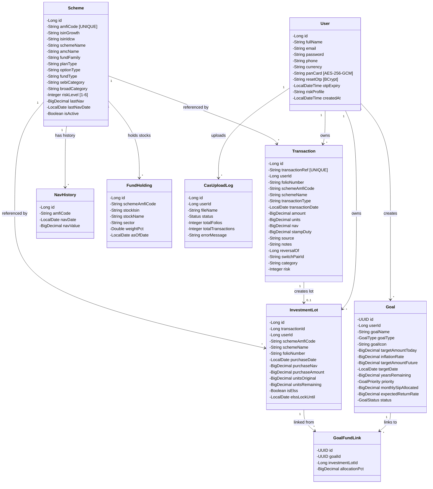

---

## 7. Sequence Diagrams

### 7.1 CAS PDF Import Flow

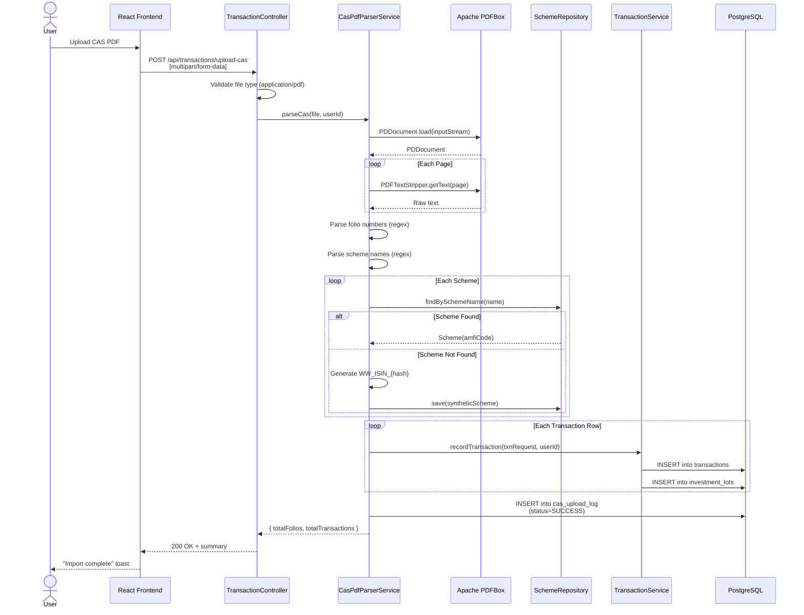

### 7.2 Transaction Recording Flow (Purchase with Lot Creation)

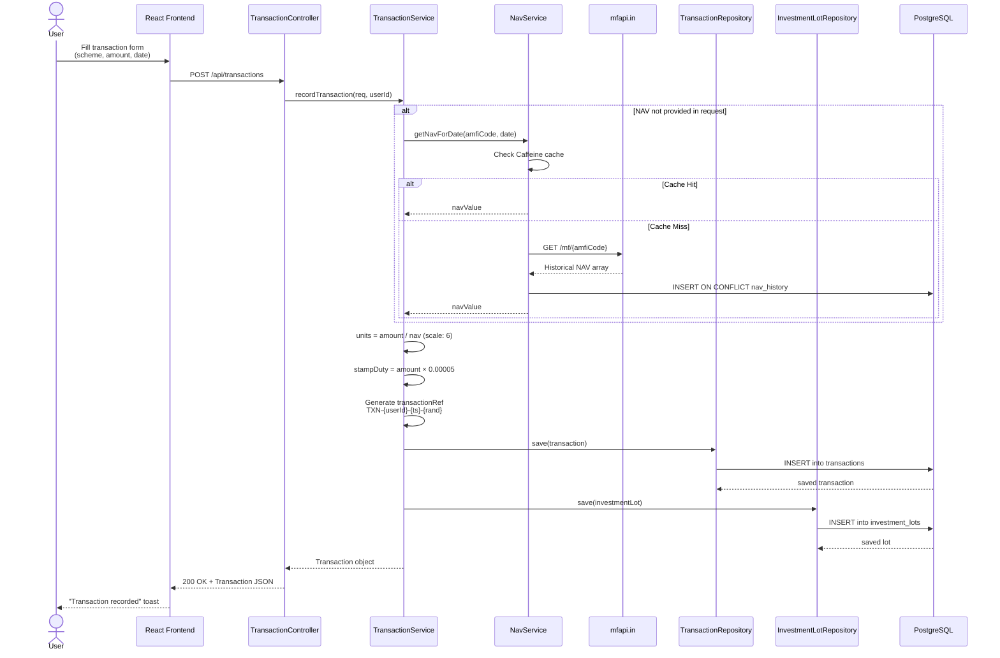

### 7.3 Goal Analysis Flow (Monte Carlo + Deterministic + Required SIP)

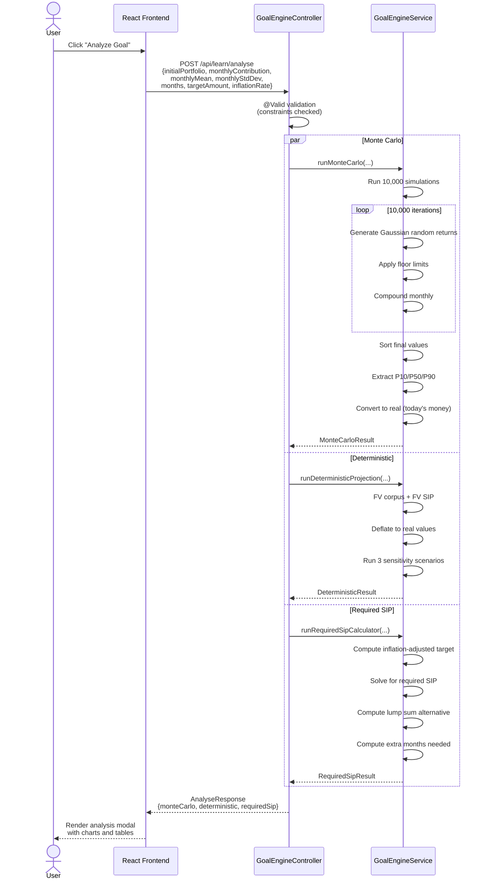

---

## 8. Data Flow Diagrams

### 8.1 DFD Level 0 (Context Diagram)

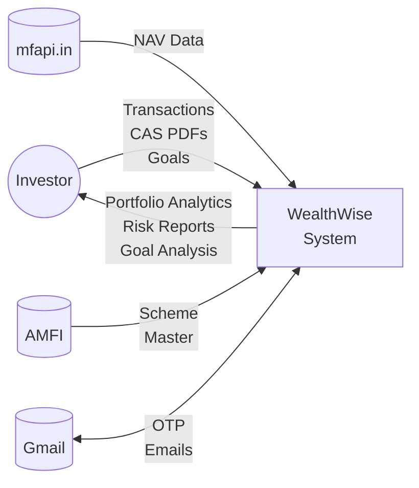

### 8.2 DFD Level 1

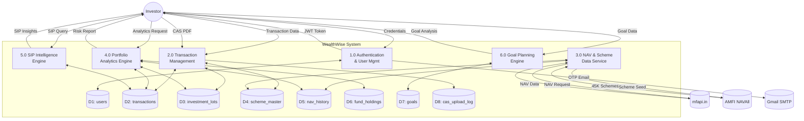

---

## 9. Database Schema Design

### 9.1 Entity-Relationship Diagram

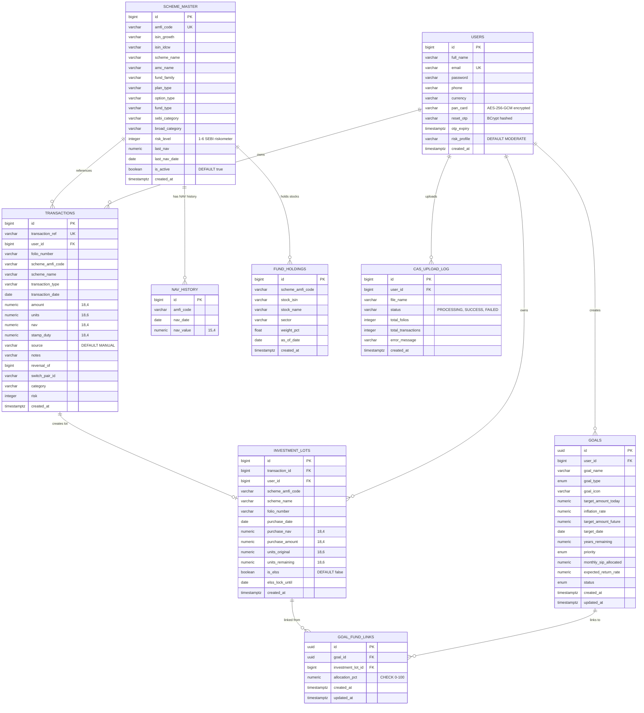

### 9.2 Table Details and Constraints

| Table | Rows (Est.) | Primary Key | Unique Constraints | Foreign Keys | Key Indexes |
|---|---|---|---|---|---|
| `users` | ~10K | `id` (BIGSERIAL) | `email` | — | email |
| `transactions` | ~500K | `id` (BIGSERIAL) | `transaction_ref` | `user_id` → users | (user_id), (user_id, scheme_amfi_code), (user_id, folio_number), (transaction_date) |
| `investment_lots` | ~500K | `id` (BIGSERIAL) | — | `transaction_id` → transactions | (user_id), (user_id, scheme_amfi_code), (user_id, folio_number), (purchase_date) |
| `scheme_master` | ~50K | `id` (BIGSERIAL) | `amfi_code` | — | (amfi_code), (scheme_name), (amc_name), (broad_category) |
| `nav_history` | ~10M | `id` (BIGSERIAL) | `(amfi_code, nav_date)` | — | (amfi_code, nav_date) |
| `fund_holdings` | ~100K | `id` (BIGSERIAL) | — | — | (scheme_amfi_code), (stock_name) |
| `goals` | ~50K | `id` (UUID) | — | `user_id` → users | (user_id) |
| `goal_fund_links` | ~100K | `id` (UUID) | — | `goal_id` → goals, `investment_lot_id` → investment_lots | (goal_id), (investment_lot_id) |
| `cas_upload_log` | ~20K | `id` (BIGSERIAL) | — | `user_id` → users | (user_id) |

### 9.3 Precision Strategy

| Data Type | Precision | Usage |
|---|---|---|
| `NUMERIC(18,4)` | 18 total digits, 4 decimal places | Monetary amounts (INR), NAV values, stamp duty |
| `NUMERIC(18,6)` | 18 total digits, 6 decimal places | Mutual fund units (MFs typically report to 3–4 decimals; 6 provides headroom) |
| `NUMERIC(15,4)` | 15 total digits, 4 decimal places | Historical NAV values (max NAV ever ≈ ₹9,999,999.9999) |

---

## 10. Detailed Function Logic / Pseudocode

### 10.1 XIRR Calculation (Newton-Raphson Method)

```
FUNCTION computeXIRR(cashflows: List<(date, amount)>) -> Double:
    // cashflows: positive for inflows (purchases), negative for outflows (current value)
    
    // Initial guess
    rate ← 0.1  // 10% annual return
    
    FOR iteration = 1 TO 100:
        // Compute NPV at current rate
        npv ← 0
        npv_derivative ← 0
        base_date ← cashflows[0].date
        
        FOR EACH (date, amount) IN cashflows:
            years ← daysBetween(base_date, date) / 365.0
            npv ← npv + amount / (1 + rate)^years
            npv_derivative ← npv_derivative - years × amount / (1 + rate)^(years + 1)
        END FOR
        
        // Newton-Raphson update
        IF |npv_derivative| < 1e-10:
            BREAK  // derivative too small, stop
        
        new_rate ← rate - npv / npv_derivative
        
        // Convergence check
        IF |new_rate - rate| < 1e-7:
            RETURN new_rate
        
        rate ← new_rate
    END FOR
    
    RETURN rate  // best estimate after 100 iterations
```

### 10.2 Monte Carlo Simulation

```
FUNCTION runMonteCarlo(corpus, sip, μ, σ, months, target, inflation) -> Result:
    monthlyInflation ← inflation / 12
    futureTarget ← target × (1 + monthlyInflation)^months
    
    finalValues ← empty list
    
    FOR sim = 1 TO 10,000:
        portfolio ← corpus
        
        FOR month = 1 TO months:
            // Generate random monthly return from Normal(μ, σ)
            r ← μ + σ × GaussianRandom()
            
            // Floor to prevent extreme negative compounding
            IF σ > 0.07: floor ← -0.30
            ELSE IF σ > 0.03: floor ← -0.20
            ELSE: floor ← -0.10
            
            r ← MAX(r, floor)
            portfolio ← portfolio × (1 + r) + sip
            portfolio ← MAX(portfolio, 0)  // cannot go negative
        END FOR
        
        finalValues.add(portfolio)
    END FOR
    
    SORT finalValues ASC
    
    // Extract percentiles and deflate to today's money
    p10 ← deflate(percentile(finalValues, 10), inflation, months)
    p50 ← deflate(percentile(finalValues, 50), inflation, months)
    p90 ← deflate(percentile(finalValues, 90), inflation, months)
    
    // Probability: count simulations exceeding FUTURE target (not deflated)
    probability ← COUNT(v >= futureTarget for v in finalValues) / 10,000 × 100
    
    RETURN { p10, p50, p90, probability }
```

### 10.3 FIFO Redemption Logic

```
FUNCTION processRedemption(userId, schemeCode, unitsToRedeem) -> void:
    // Fetch active lots ordered by purchase date (oldest first = FIFO)
    lots ← InvestmentLotRepository.findByUserIdAndSchemeAmfiCode(
                userId, schemeCode, ORDER_BY purchase_date ASC)
    
    remaining ← unitsToRedeem
    
    FOR EACH lot IN lots:
        IF remaining <= 0: BREAK
        
        // Check ELSS lock-in
        IF lot.isElss AND lot.elssLockUntil > TODAY:
            CONTINUE  // skip locked lots
        
        IF lot.unitsRemaining >= remaining:
            // Partial redemption from this lot
            lot.unitsRemaining ← lot.unitsRemaining - remaining
            remaining ← 0
        ELSE:
            // Fully redeem this lot
            remaining ← remaining - lot.unitsRemaining
            lot.unitsRemaining ← 0
        END IF
        
        LotRepository.save(lot)
    END FOR
    
    IF remaining > 0:
        THROW IllegalStateException("Insufficient units: " + remaining + " units short")
```

### 10.4 CAS PDF Parsing Pipeline

```
FUNCTION parseCas(pdfFile, userId) -> Result:
    document ← PDDocument.load(pdfFile.getInputStream())
    fullText ← PDFTextStripper.getText(document)
    
    // Phase 1: Extract folio blocks
    folioBlocks ← REGEX_SPLIT(fullText, "Folio No:\\s*(\\d+/\\d+)")
    
    result ← { totalFolios: 0, totalTransactions: 0, syntheticCodes: [] }
    
    FOR EACH (folioNumber, blockText) IN folioBlocks:
        result.totalFolios++
        
        // Phase 2: Extract scheme name from block header
        schemeName ← REGEX_MATCH(blockText, "^(.+?)\\s*-\\s*")
        
        // Phase 3: Resolve to AMFI code
        scheme ← SchemeRepository.findBySchemeName(schemeName)
        IF scheme IS NULL:
            // Try fuzzy match
            scheme ← SchemeRepository.findByNameContaining(normalize(schemeName))
        IF scheme IS NULL:
            // Generate synthetic code
            syntheticCode ← "WW_ISIN_" + MD5(schemeName).substring(0, 8)
            CREATE Scheme(amfiCode=syntheticCode, schemeName=schemeName)
            result.syntheticCodes.add(syntheticCode)
        
        // Phase 4: Parse transaction rows
        rows ← REGEX_FIND_ALL(blockText,
            "(\\d{2}-\\w{3}-\\d{4})\\s+(.+?)\\s+([\\d.]+)\\s+([\\d.]+)\\s+([\\d.]+)")
        
        FOR EACH (date, description, amount, nav, units) IN rows:
            txnType ← classifyTransactionType(description)
            TransactionService.recordTransaction({
                schemeAmfiCode, folioNumber, amount, nav, units,
                transactionDate: parseDate(date),
                transactionType: txnType,
                source: "CAS_IMPORT"
            }, userId)
            result.totalTransactions++
        END FOR
    END FOR
    
    // Phase 5: Audit log
    CasUploadLogRepository.save({
        userId, fileName: pdfFile.getOriginalFilename(),
        status: SUCCESS, totalFolios, totalTransactions
    })
    
    RETURN result
```

### 10.5 Fund Overlap Calculation

```
FUNCTION computeFundOverlapMatrix(userId) -> OverlapMatrix:
    // Step 1: Get all distinct schemes in user's portfolio
    schemeCodes ← InvestmentLotRepository
        .findDistinctSchemeCodesByUserId(userId)
        .filter(code -> NOT code.startsWith("WW_"))
    
    // Step 2: For each scheme, get stock holdings
    holdingsMap ← {}  // Map<schemeCode, Set<stockName>>
    FOR EACH code IN schemeCodes:
        holdings ← FundHoldingRepository.findBySchemeAmfiCode(code)
        IF holdings.isEmpty():
            // Trigger ingestion based on SEBI category
            FundHoldingsIngestionService.ingestForScheme(code)
            holdings ← FundHoldingRepository.findBySchemeAmfiCode(code)
        holdingsMap[code] ← holdings.map(h -> h.stockName).toSet()
    END FOR
    
    // Step 3: Compute pairwise Jaccard overlap
    matrix ← []
    highOverlapPairs ← []
    
    FOR i = 0 TO schemeCodes.size() - 1:
        FOR j = i + 1 TO schemeCodes.size() - 1:
            setA ← holdingsMap[schemeCodes[i]]
            setB ← holdingsMap[schemeCodes[j]]
            
            intersection ← setA ∩ setB
            union ← setA ∪ setB
            
            overlapPct ← (intersection.size() / union.size()) × 100
            
            matrix.add({
                schemeA: schemeCodes[i],
                schemeB: schemeCodes[j],
                overlapPct: overlapPct,
                commonStocks: intersection.toList()
            })
            
            IF overlapPct > 30:
                highOverlapPairs.add({ pair, overlapPct, suggestion })
        END FOR
    END FOR
    
    RETURN { matrix, highOverlapPairs, consolidationSuggestions }
```
