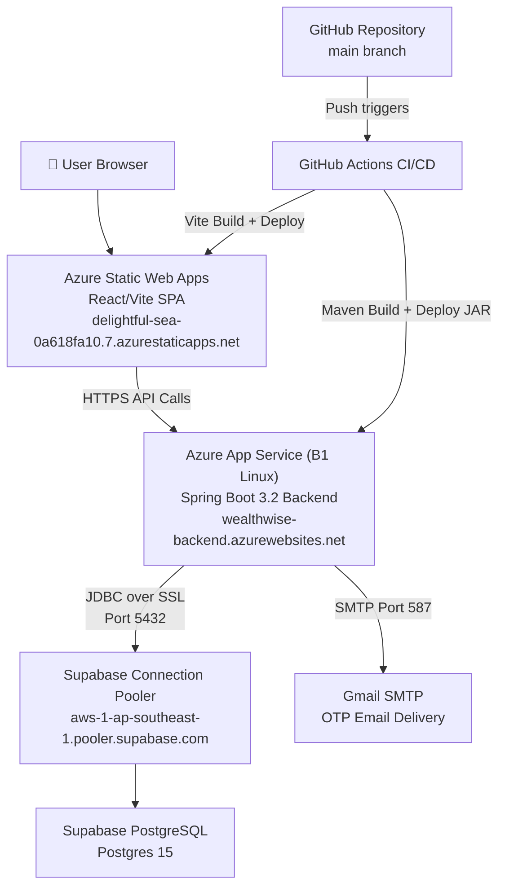

# WealthWise — Azure Deployment Guide

---

## 1. Azure Architecture Overview

WealthWise is deployed on Microsoft Azure using a two-tier cloud architecture:

| Component | Azure Service | Tier | URL |
|---|---|---|---|
| **Backend API** | Azure App Service (Linux) | B1 Basic | `https://wealthwise-backend.azurewebsites.net` |
| **Frontend SPA** | Azure Static Web Apps | Free | `https://delightful-sea-0a618fa10.7.azurestaticapps.net` |
| **Database** | Supabase PostgreSQL (via pooler) | Free | `aws-1-ap-southeast-1.pooler.supabase.com` |
| **CI/CD** | GitHub Actions | Free | Triggered on every push to `main` |

### Architecture Diagram



---

## 2. Azure Resources

### 2.1 Resource Group

| Property | Value |
|---|---|
| **Name** | `wealthwise-rg` |
| **Region** | Central India |
| **Subscription** | Pay-As-You-Go |

### 2.2 App Service Plan

| Property | Value |
|---|---|
| **Name** | `wealthwise-plan` |
| **OS** | Linux |
| **SKU** | B1 Basic (1 vCPU, 1.75 GB RAM) |
| **Region** | Central India |
| **Monthly Cost** | ~₹1,100 (~$13 USD) |

### 2.3 Backend — Azure App Service

| Property | Value |
|---|---|
| **App Name** | `wealthwise-backend` |
| **Runtime** | Java 17 (`JAVA\|17-java17`) |
| **OS** | Linux |
| **URL** | `https://wealthwise-backend.azurewebsites.net` |
| **Health Endpoint** | `GET /api/auth/health` → `{"status":"UP"}` |
| **Always On** | Enabled |

### 2.4 Frontend — Azure Static Web Apps

| Property | Value |
|---|---|
| **App Name** | `wealthwise-frontend` |
| **Tier** | Free |
| **URL** | `https://delightful-sea-0a618fa10.7.azurestaticapps.net` |
| **Build** | Vite (`npm run build`) in `/project` |
| **Output** | `/project/dist` |
| **Region** | Central US (Global CDN) |

---

## 3. CI/CD Pipeline — GitHub Actions

### 3.1 Backend Deployment Workflow

**File:** `.github/workflows/azure-backend.yml`

**Trigger:** Push to `main` branch with changes in `backend/**`

```yaml
name: Deploy Backend to Azure

on:
  push:
    branches: [main]
    paths:
      - 'backend/**'
      - '.github/workflows/azure-backend.yml'
  workflow_dispatch:

env:
  AZURE_WEBAPP_NAME: wealthwise-backend
  JAVA_VERSION: '17'

permissions:
  id-token: write
  contents: read

jobs:
  build-and-deploy:
    runs-on: ubuntu-latest
    steps:
      - uses: actions/checkout@v4

      - name: Set up JDK 17
        uses: actions/setup-java@v4
        with:
          java-version: '17'
          distribution: 'temurin'
          cache: 'maven'

      - name: Build with Maven
        run: mvn clean package -DskipTests
        working-directory: ./backend

      - name: Login to Azure
        uses: azure/login@v2
        with:
          creds: ${{ secrets.AZURE_CREDENTIALS }}

      - name: Deploy to Azure Web App
        uses: azure/webapps-deploy@v3
        with:
          app-name: wealthwise-backend
          package: backend/target/wealthwise-backend-0.0.1-SNAPSHOT.jar
```

**Pipeline Steps:**
1. Checkout repository
2. Set up JDK 17 (Eclipse Temurin) with Maven cache
3. Build JAR with `mvn clean package -DskipTests`
4. Authenticate to Azure using Service Principal (`AZURE_CREDENTIALS`)
5. Deploy JAR to Azure App Service via Zip Deploy

### 3.2 Frontend Deployment Workflow

**File:** `.github/workflows/azure-static-web-apps-delightful-sea-0a618fa10.yml`

**Trigger:** Push to `main` branch (all files)

Auto-generated by Azure when the Static Web App was created. Uses the `azure/static-web-apps-deploy@v1` action:

```yaml
name: Azure Static Web Apps CI/CD

on:
  push:
    branches: [main]
  pull_request:
    types: [opened, synchronize, reopened, closed]
    branches: [main]

jobs:
  build_and_deploy_job:
    runs-on: ubuntu-latest
    steps:
      - uses: actions/checkout@v3
      - name: Build And Deploy
        uses: Azure/static-web-apps-deploy@v1
        with:
          azure_static_web_apps_api_token: ${{ secrets.AZURE_STATIC_WEB_APPS_API_TOKEN_DELIGHTFUL_SEA_0A618FA10 }}
          action: "upload"
          app_location: "/project"
          output_location: "dist"
```

**Pipeline Steps:**
1. Checkout repository
2. Install npm dependencies (`npm ci`)
3. Run Vite build (`npm run build`) in `/project`
4. Deploy `/project/dist` to Azure Static Web Apps CDN

---

## 4. GitHub Secrets Required

The following secrets must be configured in **GitHub → Settings → Secrets and variables → Actions**:

| Secret Name | Purpose | How to Generate |
|---|---|---|
| `AZURE_CREDENTIALS` | Service Principal JSON for Azure login | `az ad sp create-for-rbac --json-auth` |
| `AZURE_STATIC_WEB_APPS_API_TOKEN_DELIGHTFUL_SEA_0A618FA10` | Static Web App deployment token | Auto-generated by Azure when SWA is linked to GitHub |

### AZURE_CREDENTIALS Format

```json
{
  "clientId": "<service-principal-client-id>",
  "clientSecret": "<service-principal-secret>",
  "subscriptionId": "<azure-subscription-id>",
  "tenantId": "<azure-tenant-id>",
  "activeDirectoryEndpointUrl": "https://login.microsoftonline.com",
  "resourceManagerEndpointUrl": "https://management.azure.com/",
  "activeDirectoryGraphResourceId": "https://graph.windows.net/",
  "sqlManagementEndpointUrl": "https://management.core.windows.net:8443/",
  "galleryEndpointUrl": "https://gallery.azure.com/",
  "managementEndpointUrl": "https://management.core.windows.net/"
}
```

---

## 5. Azure App Service Configuration

### 5.1 Environment Variables (Application Settings)

All backend secrets are stored in **Azure Portal → App Service → Configuration → Application Settings**:

| Setting Name | Value | Description |
|---|---|---|
| `SPRING_PROFILES_ACTIVE` | `azure` | Activates `application-azure.properties` |
| `WEBSITES_PORT` | `8080` | Port Azure App Service routes traffic to |
| `DB_URL` | `jdbc:postgresql://aws-1-ap-southeast-1.pooler.supabase.com:5432/postgres?sslmode=require` | Supabase connection pooler JDBC URL |
| `DB_USERNAME` | `postgres.pkktouewaqhvnwahoktn` | Supabase pooler username (project-scoped) |
| `DB_PASSWORD` | `<supabase-password>` | Supabase database password |
| `JWT_SECRET` | `<min-32-char-secret>` | JWT signing key |
| `MAIL_USERNAME` | `<gmail-address>` | Gmail for OTP delivery |
| `MAIL_PASSWORD` | `<gmail-app-password>` | Gmail App Password |
| `CORS_ALLOWED_ORIGINS` | `https://delightful-sea-0a618fa10.7.azurestaticapps.net,http://localhost:5173` | Allowed frontend origins |

### 5.2 Azure Spring Profile (application-azure.properties)

**File:** `backend/src/main/resources/application-azure.properties`

Key differences from the production Render profile:

| Setting | Azure Value | Reason |
|---|---|---|
| `spring.datasource.hikari.initialization-fail-timeout` | `-1` | Don't crash if DB connects slowly on cold start |
| `spring.jpa.defer-datasource-initialization` | `true` | Allow app to boot before DB validates |
| `spring.datasource.hikari.connection-timeout` | `60000` | 60s timeout (Azure container has more time) |
| `spring.main.lazy-initialization` | `true` | Reduce startup time |
| `server.port` | `${WEBSITES_PORT:8080}` | Reads Azure's injected port |

```properties
# Azure-specific Spring Boot profile
spring.datasource.url=${DB_URL}
spring.datasource.username=${DB_USERNAME}
spring.datasource.password=${DB_PASSWORD}
spring.datasource.driver-class-name=org.postgresql.Driver

spring.jpa.hibernate.ddl-auto=update
spring.jpa.defer-datasource-initialization=true
spring.jpa.properties.hibernate.dialect=org.hibernate.dialect.PostgreSQLDialect

app.jwt.secret=${JWT_SECRET}
server.port=${WEBSITES_PORT:8080}

# HikariCP — don't fail on slow cold start
spring.datasource.hikari.maximum-pool-size=10
spring.datasource.hikari.connection-timeout=60000
spring.datasource.hikari.initialization-fail-timeout=-1

spring.main.lazy-initialization=true
spring.main.banner-mode=off
```

---

## 6. Frontend Configuration

### 6.1 Static Web Apps Config

**File:** `staticwebapp.config.json` (project root)

```json
{
  "routes": [
    {
      "route": "/api/*",
      "allowedRoles": ["anonymous"]
    },
    {
      "route": "/*",
      "serve": "/index.html",
      "statusCode": 200
    }
  ],
  "navigationFallback": {
    "rewrite": "/index.html",
    "exclude": ["/assets/*", "*.{css,js,png,jpg,svg,ico}"]
  },
  "globalHeaders": {
    "Cache-Control": "no-cache",
    "X-Content-Type-Options": "nosniff",
    "X-Frame-Options": "DENY",
    "X-XSS-Protection": "1; mode=block"
  },
  "mimeTypes": {
    ".json": "application/json"
  }
}
```

### 6.2 Frontend Environment Variables (.env.azure)

**File:** `project/.env.azure`

```env
VITE_API_BASE_URL=https://wealthwise-backend.azurewebsites.net/api
VITE_APP_ENV=production
```

> **Note:** Vite reads `.env.production` during build. Ensure `VITE_API_BASE_URL` is set in the Static Web App environment variables in Azure Portal for it to be embedded at build time.

---

## 7. Database — Supabase Connection Pooler

Azure App Service requires the Supabase **Connection Pooler** host instead of the direct database host, because:

- The direct host (`db.<project>.supabase.co`) can fail DNS resolution in some Azure regions
- The connection pooler (`aws-1-ap-southeast-1.pooler.supabase.com`) uses PgBouncer for efficient connection management

| Property | Direct Connection | Pooler (Used for Azure) |
|---|---|---|
| **Host** | `db.pkktouewaqhvnwahoktn.supabase.co` | `aws-1-ap-southeast-1.pooler.supabase.com` |
| **Port** | `5432` | `5432` |
| **Username** | `postgres` | `postgres.pkktouewaqhvnwahoktn` |
| **SSL** | Required | Required |

---

## 8. Deployment Steps (First-Time Setup)

### Step 1: Install Azure CLI

```powershell
winget install Microsoft.AzureCLI
az login
az account set --subscription "<subscription-id>"
```

### Step 2: Create Azure Resources

```powershell
# Create resource group
az group create --name wealthwise-rg --location "Central India"

# Create App Service Plan (B1 Linux)
az appservice plan create --name wealthwise-plan --resource-group wealthwise-rg \
  --is-linux --sku B1

# Create Backend Web App (Java 17)
az webapp create --name wealthwise-backend --resource-group wealthwise-rg \
  --plan wealthwise-plan --runtime "JAVA:17-java17"

# Create Frontend Static Web App (links to GitHub)
az staticwebapp create --name wealthwise-frontend --resource-group wealthwise-rg \
  --source "https://github.com/BhuvanNagesh/VTU_INTERN_2026_TEAM11_JAVA" \
  --branch main --app-location "/project" --output-location "dist" \
  --login-with-github
```

### Step 3: Configure App Settings

```powershell
az webapp config appsettings set --name wealthwise-backend \
  --resource-group wealthwise-rg --settings \
  SPRING_PROFILES_ACTIVE="azure" \
  WEBSITES_PORT="8080" \
  DB_URL="jdbc:postgresql://aws-1-ap-southeast-1.pooler.supabase.com:5432/postgres?sslmode=require" \
  DB_USERNAME="postgres.pkktouewaqhvnwahoktn" \
  DB_PASSWORD="<your-password>" \
  JWT_SECRET="<your-32-char-secret>" \
  MAIL_USERNAME="<your-gmail>" \
  MAIL_PASSWORD="<your-app-password>" \
  CORS_ALLOWED_ORIGINS="https://delightful-sea-0a618fa10.7.azurestaticapps.net,http://localhost:5173"
```

### Step 4: Create GitHub Service Principal

```powershell
az ad sp create-for-rbac --name "wealthwise-github-deploy" \
  --role contributor \
  --scopes /subscriptions/<subscription-id>/resourceGroups/wealthwise-rg \
  --json-auth
```

Copy the JSON output and save it as the GitHub secret `AZURE_CREDENTIALS`.

### Step 5: Add GitHub Secrets

Go to **GitHub → Repository → Settings → Secrets and variables → Actions → New repository secret**:

1. Name: `AZURE_CREDENTIALS` → Paste the service principal JSON
2. The Static Web App token (`AZURE_STATIC_WEB_APPS_API_TOKEN_*`) is auto-added by Azure when the SWA is linked

### Step 6: Push to Main

```powershell
git push origin main
```

GitHub Actions will:
- Build the Spring Boot JAR with Maven on ubuntu-latest
- Deploy the JAR to Azure App Service (Zip Deploy)
- Build the Vite SPA and deploy to Azure Static Web Apps CDN

### Step 7: Verify Deployment

```powershell
# Test backend health
curl https://wealthwise-backend.azurewebsites.net/api/auth/health
# Expected: {"status":"UP"}

# Test frontend
# Open in browser: https://delightful-sea-0a618fa10.7.azurestaticapps.net
```

---

## 9. Monitoring & Logs

### 9.1 View Application Logs

```powershell
# Stream live logs
az webapp log tail --name wealthwise-backend --resource-group wealthwise-rg

# Download all logs
az webapp log download --name wealthwise-backend \
  --resource-group wealthwise-rg --log-file logs.zip
```

### 9.2 Stream Logs in Azure Portal

1. Go to **Azure Portal → App Service → wealthwise-backend**
2. Under **Monitoring** → **Log stream**
3. Logs stream in real-time including Spring Boot output

### 9.3 Application Insights (Optional)

For advanced monitoring, connect Application Insights:

```powershell
az monitor app-insights component create --app wealthwise-insights \
  --location "Central India" --resource-group wealthwise-rg

az webapp config appsettings set --name wealthwise-backend \
  --resource-group wealthwise-rg --settings \
  APPLICATIONINSIGHTS_CONNECTION_STRING="<connection-string>"
```

---

## 10. Troubleshooting — Azure Specific

### Issue 1: Container timeout on startup (503)

**Symptom:** `Container did not start within expected time limit of 230s`

**Cause:** App crashes during startup, usually due to DB connection failure.

**Fix:**
- Check logs: `az webapp log tail --name wealthwise-backend --resource-group wealthwise-rg`
- Verify all env vars are set: `az webapp config appsettings list --name wealthwise-backend --resource-group wealthwise-rg`
- Ensure `spring.datasource.hikari.initialization-fail-timeout=-1` is in `application-azure.properties`

### Issue 2: UnknownHostException for Supabase host

**Symptom:** `java.net.UnknownHostException: db.pkktouewaqhvnwahoktn.supabase.co`

**Cause:** Azure's DNS cannot resolve the direct Supabase host in some regions.

**Fix:** Switch to the Supabase Connection Pooler URL:
```
DB_URL=jdbc:postgresql://aws-1-ap-southeast-1.pooler.supabase.com:5432/postgres?sslmode=require
DB_USERNAME=postgres.<project-ref>
```

### Issue 3: GitHub Actions deploy fails — "Publish profile is invalid"

**Symptom:** `Error: Deployment Failed, Error: Publish profile is invalid`

**Cause:** Using publish profile method instead of service principal.

**Fix:** Use `azure/login@v2` with `AZURE_CREDENTIALS` service principal secret instead of `AZURE_WEBAPP_PUBLISH_PROFILE`.

### Issue 4: Frontend shows blank page or 404 on refresh

**Symptom:** Navigating directly to `/dashboard` returns 404.

**Cause:** SPA routing — Azure Static Web Apps needs a fallback rule.

**Fix:** Ensure `staticwebapp.config.json` has the navigation fallback:
```json
{
  "navigationFallback": {
    "rewrite": "/index.html"
  }
}
```

### Issue 5: CORS error in browser console

**Symptom:** `Access to XMLHttpRequest at 'https://wealthwise-backend...' from origin 'https://delightful-sea...' has been blocked by CORS policy`

**Fix:** Update `CORS_ALLOWED_ORIGINS` in App Service settings to include the frontend URL:
```powershell
az webapp config appsettings set --name wealthwise-backend \
  --resource-group wealthwise-rg --settings \
  CORS_ALLOWED_ORIGINS="https://delightful-sea-0a618fa10.7.azurestaticapps.net,http://localhost:5173"
az webapp restart --name wealthwise-backend --resource-group wealthwise-rg
```

### Issue 6: Build fails — "Could not find artifact"

**Symptom:** GitHub Actions fails at the Maven build step.

**Cause:** `pom.xml` or dependency resolution issue.

**Fix:** Add `mvn dependency:resolve` step before `package`, or check `pom.xml` for invalid dependencies.

### Issue 7: App restarts losing state

**Expected behavior.** Azure App Service B1 is stateless. JWT tokens remain valid across restarts as long as `JWT_SECRET` doesn't change. All data persists in Supabase.

---

## 11. Cost Summary

| Resource | Tier | Monthly Cost (INR) | Monthly Cost (USD) |
|---|---|---|---|
| App Service Plan B1 | Basic | ~₹1,100 | ~$13 |
| Azure Static Web Apps | Free | ₹0 | $0 |
| Supabase PostgreSQL | Free (500 MB) | ₹0 | $0 |
| GitHub Actions | Free (2,000 min/month) | ₹0 | $0 |
| **Total** | | **~₹1,100** | **~$13** |

> **Cost optimisation tip:** To reduce cost to ₹0, switch to Azure Static Web Apps Managed Functions for the backend (requires refactoring to Azure Functions), or use Render's free tier for the backend.

---

## 12. Comparison: Azure vs Render Deployment

| Aspect | Azure (Current) | Render (Previous) |
|---|---|---|
| **Backend Runtime** | Azure App Service B1 Linux | Docker container (free tier) |
| **Build** | GitHub Actions (Maven on ubuntu-latest) | Docker build from Dockerfile |
| **Cold Start** | ~30–60s (Always On enabled) | ~90s (free tier spins down) |
| **Cost** | ~$13/month | $0 (free tier) |
| **Always On** | ✅ Yes (B1 tier) | ❌ No (spins down after 15 min) |
| **CI/CD** | GitHub Actions (automatic) | Render auto-deploy from GitHub |
| **Database** | Supabase (pooler) | Supabase (direct) |
| **Frontend** | Azure Static Web Apps (CDN) | Render Static Site |
| **SSL** | ✅ Included | ✅ Included |
| **Custom Domain** | ✅ Supported | ✅ Supported (free) |
